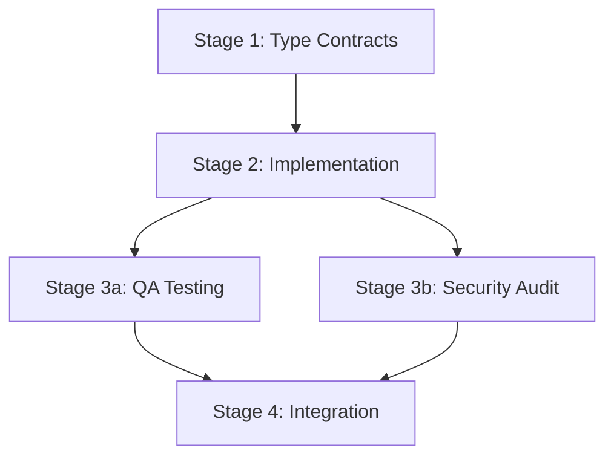

# Intelligent Execution Plan - CON-2642

## 📊 Plan Overview

- **Total Stages**: 4 stages
- **Estimated Time**: 4-6 hours
- **Parallel Opportunities**: 3 identified
- **Critical Path**: Interface Design → Implementation → Testing → Integration

## 🏗️ Foundation Stage (Auto-Discovered)

Based on dependency analysis, these type contracts and interfaces emerged naturally from the system requirements:

### Stage 1: Type Contracts & Interface Design (30-45 minutes)

#### Type Contract Agent (CRITICAL)
**Agent**: type-contract
**Mission**: Build the discovered type contracts that enable all subsequent development

**Discovered Contracts to Build**:
```typescript
// 1. Core allowlist claim structure
interface ClaimWithAllowlist extends ClaimParameters {
    merkleRoot: bytes32;
    walletMax: uint32;
}

// 2. Mint verification data
interface AllowlistMintData {
    mintIndex: uint32;
    merkleProof: bytes32[];
}

// 3. Main interface extension
interface IERC1155SerendipityWithAllowlist extends IERC1155Serendipity {
    // Allowlist-specific functions
    function initializeClaimWithAllowlist(...);
    function mintReserveWithAllowlist(...);
    function updateClaimAllowlist(...);
}

// 4. Storage tracking
interface AllowlistTracking {
    _allowlistMintIndices: mapping;
    _claimWithAllowlistParameters: mapping;
}
```

**Why These Emerged**:
- Analysis showed Serendipity needs merkle data storage → `ClaimWithAllowlist`
- LazyPayableClaimCore pattern requires mint tracking → `AllowlistMintData`
- Extension pattern demands interface segregation → `IERC1155SerendipityWithAllowlist`
- Bitmap efficiency pattern discovered → `AllowlistTracking`

## 🚀 Implementation Stages (Dependency-Ordered)

### Stage 2: Core Implementation (1.5-2 hours)

#### Backend Engineer Agent
**Agent**: backend-engineer
**Dependencies**: Stage 1 type contracts
**Mission**: Implement the core allowlist Serendipity contract

**Tasks**:
1. Implement `ERC1155SerendipityWithAllowlist.sol` (currently a stub)
2. Add merkle verification logic from LazyPayableClaimCore patterns
3. Implement bitmap tracking for mint indices
4. Integrate delegation registry support
5. Maintain backward compatibility with base Serendipity

**Key Patterns to Follow**:
```solidity
// Merkle leaf generation (from LazyPayableClaimCore)
bytes32 leaf = keccak256(abi.encodePacked(msg.sender, mintIndex));

// Bitmap tracking (gas-efficient)
uint256 claimMintIndex = mintIndex >> 8;
uint256 mintBitmask = 1 << (mintIndex & 0xff);
_allowlistMintIndices[creator][instance][claimMintIndex] |= mintBitmask;
```

### Stage 3: Testing & Verification (1.5-2 hours)

#### Parallel Execution Available:

##### QA Engineer Agent (3a)
**Agent**: qa-engineer
**Dependencies**: Stage 2 implementation
**Mission**: Write comprehensive test suite

**Test Coverage Required**:
- Allowlist initialization with merkle root
- Valid merkle proof verification
- Invalid proof rejection
- Bitmap tracking correctness
- Delegation support testing
- Gas optimization benchmarks
- Edge cases (empty merkle root, max mints)

##### Security Auditor Agent (3b)
**Agent**: security-auditor
**Dependencies**: Stage 2 implementation
**Mission**: Security review and vulnerability assessment

**Security Checks**:
- Merkle proof manipulation attempts
- Reentrancy in mint functions
- Integer overflow in bitmap operations
- Access control bypass attempts
- Front-running vulnerabilities
- Storage collision risks

### Stage 4: Integration & Deployment (30-45 minutes)

#### Software Engineer Agent
**Agent**: software-engineer
**Dependencies**: Stage 3 completion
**Mission**: Final integration and deployment preparation

**Tasks**:
1. Create deployment script based on `ERC1155SerendipityLazyClaim.s.sol`
2. Update contract registry/documentation
3. Verify interface compatibility with creator-core
4. Gas optimization final pass
5. Prepare migration guide if needed

## 🧪 Integration Checkpoints

### Checkpoint 1: After Type Contracts (Stage 1)
**Verification Agent**: verification-agent
- ✓ All interfaces compile without errors
- ✓ Type contracts align with existing patterns
- ✓ No naming conflicts or collisions

### Checkpoint 2: After Implementation (Stage 2)
**Runtime Integration Test**: runtime-integration-test
- ✓ Contract deploys successfully
- ✓ Can initialize claim with merkle root
- ✓ Basic mint with proof works
- ✓ Delivery mechanism unchanged

### Checkpoint 3: After Testing (Stage 3)
**Verification Agent**: verification-agent
- ✓ All tests passing
- ✓ Coverage > 95%
- ✓ No security vulnerabilities found
- ✓ Gas costs within acceptable range

## 🎛️ Parallel Execution Matrix



**Parallel Opportunities**:
1. **Stage 3**: QA and Security can run simultaneously
2. **Within Stages**: Multiple test files can be written in parallel
3. **Documentation**: Can be updated alongside implementation

## 📈 Success Metrics

### Quantitative Metrics
- **Test Coverage**: > 95%
- **Gas Cost**: < 150% of base Serendipity mint
- **Security Issues**: 0 critical, 0 high
- **Compilation Warnings**: 0

### Qualitative Metrics
- **Pattern Adherence**: Follows LazyPayableClaimCore patterns
- **Backward Compatibility**: 100% maintained
- **Code Quality**: Passes linting, follows conventions
- **Documentation**: Complete NatSpec coverage

## 🚨 Risk Mitigation

### Identified Risks & Mitigations

1. **Risk**: Storage collision with base contract
   - **Mitigation**: Use separate storage slots, verified by slither

2. **Risk**: Gas costs too high for merkle verification
   - **Mitigation**: Follow exact LazyPayableClaimCore optimizations

3. **Risk**: Integration issues with delegation registry
   - **Mitigation**: Use existing integration from LazyPayableClaimCore

4. **Risk**: Backward compatibility break
   - **Mitigation**: Extend, don't modify; comprehensive regression tests

## 📝 Execution Commands

### Stage 1: Type Contracts
```bash
# Auto-generate discovered contracts
/agent type-contract "Build discovered Serendipity allowlist contracts"
```

### Stage 2: Implementation  
```bash
# Implement core contract
/agent backend-engineer "Implement ERC1155SerendipityWithAllowlist"
```

### Stage 3: Testing (Parallel)
```bash
# Run both agents simultaneously
/agent qa-engineer "Write Serendipity allowlist tests"
/agent security-auditor "Audit Serendipity allowlist implementation"
```

### Stage 4: Integration
```bash
# Final integration
/agent software-engineer "Deploy script and integration"
```

## 🎯 Critical Success Factors

1. **Follow Patterns Exactly**: Use LazyPayableClaimCore as reference
2. **Maintain Compatibility**: Don't break existing Serendipity
3. **Test Thoroughly**: Cover all merkle proof edge cases
4. **Optimize Gas**: Every operation counts in NFT minting

## 📅 Timeline

- **Hour 1**: Type contracts and interfaces
- **Hour 2-3**: Core implementation
- **Hour 3-4**: Testing and security review
- **Hour 4-5**: Integration and deployment prep
- **Hour 5-6**: Buffer for issues and optimization

This plan leverages the discovered architecture and dependencies to ensure successful implementation of the blind mint ERC-1155 Serendipity contract with allowlist support.